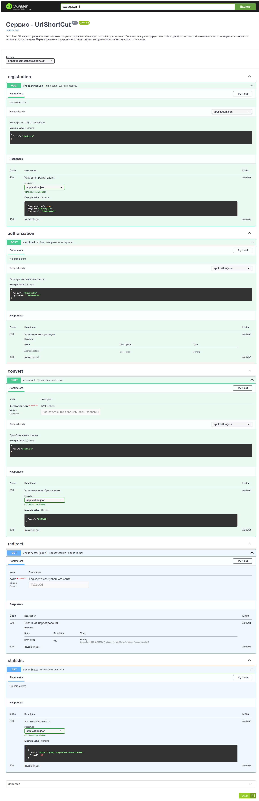

Проект "Сервис - UrlShortCut" job4j_url_shortcut
---

>Это REST API приложение 
> ### [Описание API через Swagger](https://adikiaa.github.io/job4j_url_shortcut/)

## Содержание

- [Обшая инофмация](#Общая-информация)
- [Технологии](#Технологии)
- [Запуск проекта](#Запуск-проекта)
- [Скриншоты](#Скриншоты)
- [Контакты](#Контакты)

## Общая информация

Этот Rest API сервис предоставяляет возможность регистрировать url и получить
shrotcut для этого url. Пользователь регистрирует свой сайт и преобразует 
свои собственные ссылки с помощью этого сервиса и вставляет их куда угодно. 
Перенаправление осуществляется через сервис, который подсчитывает переходы по ссылкам.


## Технологии

- Java 17
- Database:
    - PostgreSQL 14
- JDBC
- Hibernate
- Spring boot 2
- Spring Data JPA
- Spring Security & JWT authorization
- Maven

## Запуск проекта

```
create database url_shortcut;
```
```
mvn compile;
```

## Скриншоты

#### Rest API
### [Описание API через Swagger](https://adikiaa.github.io/job4j_url_shortcut/)


## Контакты

https://github.com/ADIKIAA


